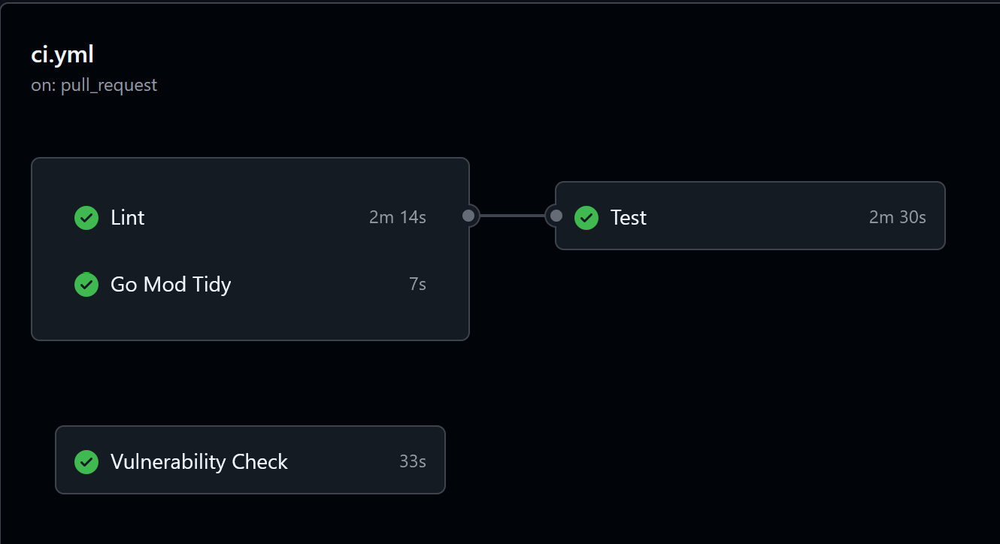
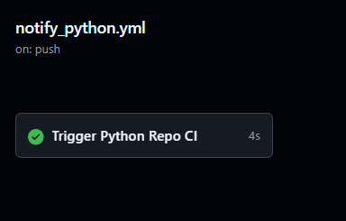
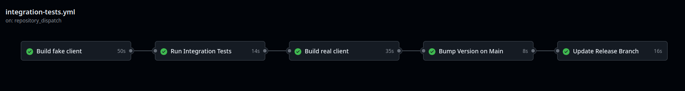

# Dokumentacja dla eksperta od oprogramowania PZSP2 – Zespół 1 – teams

## Repozytorium kodu z dostępem online

Utworzona została organizacja w serwisie GitHub, w skład której wchodzą 3
repozytoria:

- biblioteka ułatwiająca komunikację z API MS Teams
  [lib](https://github.com/pzsp-teams/lib)
- binding biblioteki w pythonie
  [lib-python](https://github.com/pzsp-teams/lib-python)
- aplikacja terminalowa prezentująca użycie biblioteki
  [cli](https://github.com/pzsp-teams/cli)


## Metodyka tworzenia kodu

Na githubie tworzone są issues, które są przydzielane jako zadania do
konkretnych osób. Do każdego feature tworzony jest osobny branch. Po wstępnym
zakończeniu pracy nad funkcjonalnością tworzony jest Pull Request. Aby
sfinalizować Pull Request wymagane zaakceptowanie przez przynajmniej jednego
innego maintainera. Jeśli reviewer negatywnie oceni jakość powstałego kodu,
zostawia komentarze, do których musi odnieść się autor kodu.

## Wybór języka

Do wykonania projektu został wybrany język **Go**. Go posiada bardzo bogaty
ekosystem do aplikacji typu CLI np. *cobra*, *bubbletea*. W języku tym można
również korzystać gotowych rozwiązań Microsoftu takich jak MSAL (biblioteka do
autoryzacji) oraz MSGraphSDK. System do zarządzania dependencjami jest bardzo
dobry i lepszy niż w językach typu Python. Innym kryterium wyboru była chęć
nauczenia się nowego języka, który ma dobrą reputację.

Jako ilustracja możliwości portowania biblioteki został wybrany język **Python**

## Pipeline'y CI/CD

**CI na lib**

- **Lint** - statyczna analiza kodu przy pomocy golangci-lint
- **Go Mod Tidy** - sprawdzenie, czy z plikach obsługujących pakiety nie ma
  nadmiarowych dependencji
- **Test** - kiedy przejdą poprzednie sekcje, uruchamiane są testy jednostkowe
- **Vulnerability Check** - analiza pod kątem znanych podatności

Używane narzędzie to **golangci-lint**. Jego konfiguracja znajduje się w pliku
*.golangci.yml*. CI uruchamia wiele różnych, zewnętrznych linterów (np.
gocritic, gocyclo etc.) i na podstawie ich właściwości ocenia poprawności kodu.
Do formatowania wykorzystane zostały wykorzystane narzędzia domyślna języka go -
**gofmt** i **goimports**.



**Generowanie i publikowanie dokumentacji na lib oraz lib-python**

- **Build Docs** - wygenerowanie dokumentacji przez MkDocs
- **Deploy to GitHub Pages** - deployment strony z dokumentacją


**Powiadomienie o nowej wersji lib**

Kiedy w głównym repozytorium biblioteki w Go znajdzie się nowa wersja, uruchamiany jest pipeline biblioteki w Pythonie.



**Testy integracyjne w Pythonie**

1. **Build fake client** - kompiluje bridge Go z zamockowanym API Microsoft Teams do testów
2. **Run Integration Tests** - odpala testy integracyjne
3. **Build real client** - kompilacja Go z prawdziwym API Microsoft Teams
4. **Bump Version on Main** - aktualizacja numeru wersji biblioteki Python
5. **Update release branch** - aktualizacja brancha python-release



Scenariusze działania tego potoku:
- **przy powiadomieniu z repozytorium Go** - wszystkie 5 stagów uruchamia się z nowo pobraną wersją biblioteki Go wskazaną w powiadomieniu.
- **przy pull request** - uruchamiają się stage 1, 2, 3 w celu sprawdzenia, czy nowa wersja działa poprawnie.
- **przy pushu na main** - testy zostały już przeprowadzone, więc uruchamiają się tylko stage 3, 4, 5, aby przygotować wersję do opublikowania.

**Publikacja w PyPi**

- **Upload release to PyPi** - wprowadzenie nowej wersji do PyPi (z brancha python-release)


## Propozycje testów akceptacyjnych

### Test Akceptacyjny: Wysyłanie wiadomości na kanały Teams

**Scenariusz:** Wysłanie spersonalizowanej wiadomości na wybrane kanały zespołu

______________________________________________________________________

#### Pliki testowe

**Plik: message.txt**

```
@@channel@@,

Przypominam o spotkaniu {{ .data }} o godzinie {{ .godzina }}.

Temat spotkania: {{ .temat }}

Prosimy o przygotowanie:
{{ .zadanie }}

Pozdrawiam,
Kierownik Projektu
```

**Plik: variables.json**

```json
{
  "General": {
    "data": "1 grudnia 2025",
    "godzina": "10:00",
    "temat": "Spotkanie ogólne Q4",
    "zadanie": "Raport z postępów"
  },
  "Projekty": {
    "data": "1 grudnia 2025",
    "godzina": "11:00",
    "temat": "Review projektów",
    "zadanie": "Prezentacja projektu"
  },
  "Kampanie": {
    "zespol": "Zespole marketingowy",
    "data": "1 grudnia 2025",
    "godzina": "14:00",
    "temat": "Podsumowanie kampanii",
    "zadanie": "Analiza wyników"
  }
}
```

______________________________________________________________________

#### Kroki testowe

##### Krok 1: Przygotowanie plików

**Akcja użytkownika:**

- Użytkownik tworzy plik `message.txt` z szablonem wiadomości zawierającym
  placeholdery
- Użytkownik tworzy plik `variables.json` z wartościami dla każdego kanału

##### Krok 2: Wykonanie komendy

**Akcja użytkownika:**

```bash
teams-cli channels messages send --template message.txt --data variables.json --team MyTeam
```

##### Krok 3: Przetwarzanie przez system

**Akcja systemu:**

- System odczytuje szablon z pliku `message.txt`
- System odczytuje zmienne dla każdego kanału z pliku `variables.json`
- System podstawia odpowiednie zmienne dla każdego kanału
- System wysyła wiadomości do kanałów podanych w pliku `variables.json`

##### Krok 4: Otrzymanie potwierdzenia

**Wyświetlony wynik:**

```
Send complete - successful: 3, total: 3
```

______________________________________________________________________

#### Kryteria akceptacji

- System podstawia różne wartości zmiennych w wiadomościach dla każdego kanału
- Każdy kanał wymieniony w pliku `variables.json` otrzymuje spersonalizowaną
  wiadomość
- Komunikat końcowy informuje o liczbie pomyślnie wysłanych wiadomości

### Test Akceptacyjny: Pobieranie wiadomości Teams z zakresu czasowego

**Scenariusz:** Pobranie wiadomości użytkownika z podanego okresu czasu

______________________________________________________________________

#### Kroki testowe

##### Krok 1: Wykonanie komendy

**Akcja użytkownika:**

```bash
teams-cli channels messages get
```

##### Krok 2: Przetwarzanie przez system

**Akcja systemu:**

- System pobiera listę nieodczytanych wiadomości użytkownika
- System wyświetla listę nieodczytanych wiadomości

##### Krok 3: Otrzymanie potwierdzenia

**Wyświetlony wynik:**

```
FROM:    Kamil
TEAM:    pzsp2z1teams
CHANNEL: test-general2
DATE:    17 Jan 26 14:48 UTC

Wiadomość testowa na test-general-2

--------------------------------------------------

FROM:    Kamil
TEAM:    pzsp2z1teams
CHANNEL: General
DATE:    17 Jan 26 14:47 UTC

Wiadomość testowa

--------------------------------------------------
```

______________________________________________________________________

#### Kryteria akceptacji

- System pobiera wszystkie nieodczytane wiadomości użytkownika
- System wyświetla szczegóły każdej wiadomości
- System wyświetla treść wiadomości w formie
- Komunikat końcowy potwierdza poprawne pobranie listy wiadomości

### Test Akceptacyjny: Automatyczne tworzenie kanałów dla grup projektowych

**Scenariusz:** Automatyczne generowanie numerowanych kanałów i przypisywanie do
nich zdefiniowanych grup użytkowników

______________________________________________________________________

#### Pliki testowe

**Plik: groups_config.json**

```json
{
  "general2": {
    "owners": [
      "kmarsza@pzsp2z1teams.onmicrosoft.com"
    ],
    "members": [
      "ddsouza@pzsp2z1teams.onmicrosoft.com"
    ]
  },
  "random": {
    "owners": [
      "msuski@pzsp2z1teams.onmicrosoft.com"
    ],
    "members": [
      "kmarsza@pzsp2z1teams.onmicrosoft.com"
    ]
  }
}
```

______________________________________________________________________

#### Kroki testowe

##### Krok 1: Przygotowanie plików

**Akcja użytkownika:**

- Użytkownik tworzy plik `groups_config.json` definiujący listę obiektów (grup)
- Każdy obiekt zawiera listę adresów e-mail użytkowników Teams, którzy mają
  znaleźć się w jednej grupie

##### Krok 2: Wykonanie komendy

**Akcja użytkownika:**

```bash
teams-cli channels create --data groups_config.json --team Team
```

##### Krok 3: Przetwarzanie przez system

**Akcja systemu:**

- System odczytuje konfigurację z pliku `groups_config.json`
- System generuje nazwę kanału łącząc podaną nazwę bazową (--base-name) z
  kolejnym numerem (np. "Zespół Projektowy 1")
- System tworzy nowy kanał dla każdej grupy zdefiniowanej w pliku
- System dodaje użytkowników z listy members do odpowiadającego im, nowo
  utworzonego kanału

##### Krok 4: Otrzymanie potwierdzenia

**Wyświetlony wynik:**

```
Created - channel: general2
Members: ddsouza@pzsp2z1teams.onmicrosoft.com
Owners: kmarsza@pzsp2z1teams.onmicrosoft.com
Created - channel: random
Members: kmarsza@pzsp2z1teams.onmicrosoft.com
Owners: msuski@pzsp2z1teams.onmicrosoft.com
Channel creation completed - successful: 2, total: 2
```

______________________________________________________________________

#### Kryteria akceptacji

- Do każdego numerowanego kanału trafiają wyłącznie użytkownicy zdefiniowani dla
  tej konkretnej grupy w pliku
- Liczba utworzonych kanałów odpowiada liczbie obiektów w pliku konfiguracyjnym
- Komunikat końcowy potwierdza pomyślne utworzenie wszystkich kanałów

Wszystkie testy akceptacyjne zostały spełnione
